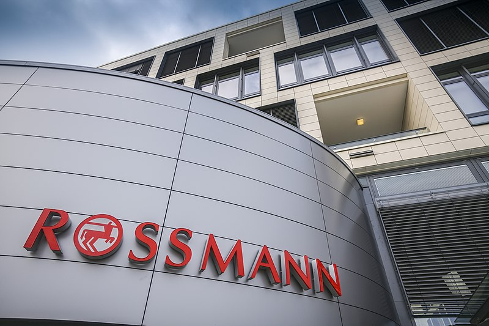
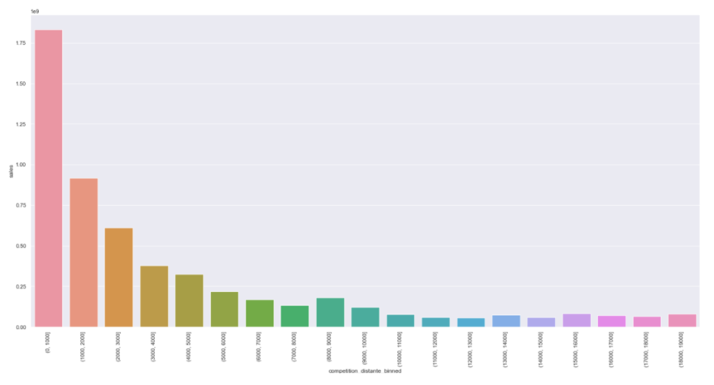
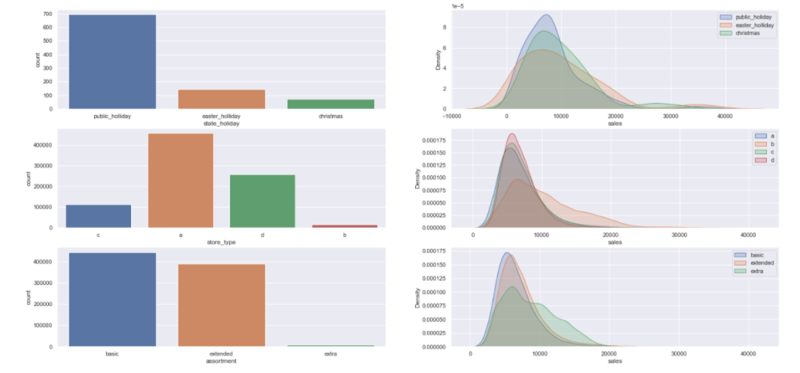
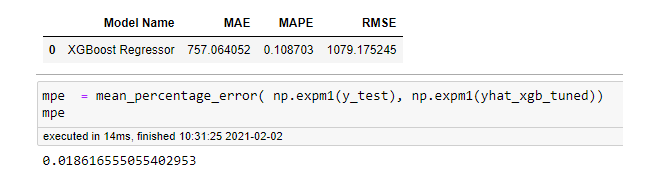
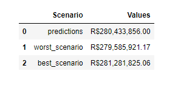

# The Rossmann Sales Forecast

# Business Problem

Dirk Rossmann GmbH is one of the largest drug store chains in Europe with around 56,200 employees and more than 4000 stores across Europe. Currently, Rossmann store managers are tasked with predicting their daily sales for up to six weeks in advance. Store sales are influenced by many factors, including promotions, competition, school and state holidays, seasonality, and locality. With thousands of individual managers predicting sales based on their own experiences, the accuracy of results can be quite varied.

# The Solution Strategy

Data Science team develop a Machine Learning Model that predict with a good accuracy in sales forecast and be easier to consult (on the telegram or on the web application).

**Step 01. Data Description** : Using statics metrics to describe our data.

**Step 02. Feature Engieneering** : based on step 01 create new features on the original that better describe the sales.

**Step 03. Exploratory Data Analysis** : Explore data to find insights and the features that better describe the stores sales.

**Step 04. Feature Selection** : Select the most importante feature to train the machine learning model.

**Step 05. Machine Learning Models** : Creating some Machine Learning models to search the best model for the project

**Step 06. Tunning Hyper Parameters** : Find the best values of each parameter of the selected Model.

**Step 07. Convert Model Performance to Business Values** : Convert the performance of the Machine Learning model into a business result.

# The Dataset

The dataset is available on kaggle plataform(https://www.kaggle.com/c/rossmann-store-sales/data).

# Top Data Insights 

Sales grow more the shorter the distance to a competitor. 

Stores type A and D has higher sales

Sales increase on public Holidays.

Sales are increased to smaller assortment.

## Machine Learning Models

Models used in this project:
* Average - Baseline
* Linear Regression
* Lasso Regression
* Random Forest Regressor
* XGBoost Regressor

## Models Performance

XGBoost presents the best performance with a accuracy of **98%**.

## Convert Model Performance to Business Values

Based on the dataset we can imagine scenarios for the worst, best and ideal cases.

# Next Steps
* Workshop for the Bussiness Users.
* collect feedback about the Model's useability.
* Improve in 10% the Model's accuracy.

# Contact

Email: danilofelipeneto@gmail.com

Linkedin: https://www.linkedin.com/in/danilo-felipe-neto-972b45120/
